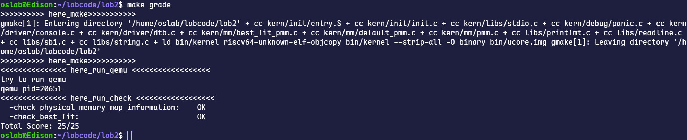

# 实验二：物理内存管理

## 练习1：理解first-fit 连续物理内存分配算法（思考题）

>first-fit 连续物理内存分配算法作为物理内存分配一个很基础的方法，需要同学们理解它的实现过程。请大家仔细阅读实验手册的教程并结合`kern/mm/default_pmm.c`中的相关代码，认真分析default_init，default_init_memmap，default_alloc_pages， default_free_pages等相关函数，并描述程序在进行物理内存分配的过程以及各个函数的作用。

### 设计实现过程分析

First-fit算法的思路大致如下：当需要分配内存时，从头开始遍历空闲内存块链表，找到第一个大小足够满足请求的内存块，然后从这个块中分割出所需大小的内存。

程序通过一个名为 `free_area` 的全局变量来管理所有的空闲内存。这个结构体里包含一个双向链表头 `free_list` 和一个记录总空闲页数的计数器 `nr_free`。链表中的每一个节点都代表一个连续的空闲物理内存块。

下面是各个函数的作用分析：

#### 1. **`default_init()`**

   ```c
    static void
    default_init(void) {
      list_init(&free_list);
      nr_free = 0;//nr_free可以理解为在这里可以使用的一个全局变量，记录可用的物理页面数
    }
  ```

- **作用**：这个函数是物理内存管理器（PMM）的初始化函数。
- **过程**：它的任务是调用 `list_init` 函数来初始化 `free_list` 链表，把它变成一个空的双向循环链表。同时，将表示总空闲页数量的 `nr_free` 变量置为0。这说明物理内存管理模块已经准备好，但还没有任何可用的空闲内存。

#### 2. **`default_init_memmap(struct Page \*base, size_t n)`**

   ```c
    static void
    default_init_memmap(struct Page *base, size_t n) {
        assert(n > 0);
        struct Page *p = base;
        for (; p != base + n; p ++) {
            assert(PageReserved(p));
            p->flags = p->property = 0;
            set_page_ref(p, 0);
        }
        base->property = n;
        SetPageProperty(base);
        nr_free += n;
        if (list_empty(&free_list)) {
            list_add(&free_list, &(base->page_link));
        } else {
            list_entry_t* le = &free_list;
            while ((le = list_next(le)) != &free_list) {
                struct Page* page = le2page(le, page_link);
                if (base < page) {
                    list_add_before(le, &(base->page_link));
                    break;
                } else if (list_next(le) == &free_list) {
                    list_add(le, &(base->page_link));
                }
            }
        }
    }
   ```

- **作用**：这个函数在 `page_init` 函数中被调用，用于将一段探测到的、可用的连续物理内存空间（从 `base` 开始，共 `n` 个页）添加到空闲链表中进行管理。
- **过程**：
  - 首先，它会遍历这 `n` 个物理页对应的 `Page` 结构体，清除它们的 `flags` 和 `property` 字段，并将引用计数 `ref` 置为0。
  - 然后，它将这段连续内存作为一个大的空闲块。这个块的首页（`base`）的 `property` 字段被设置为 `n`，表示这个空闲块的总页数。`SetPageProperty(base)` 会设置 `base` 的 `flags` 中的 `PG_property` 位，标志着这是一个空闲块的起始页。
  - 全局空闲页数 `nr_free` 会加上 `n`。
  - 最后，这个新的空闲块会被插入到 `free_list` 中。为了方便后续的合并操作，`free_list` 是一个**按物理地址从小到大排序**的链表。因此，代码会遍历链表，找到第一个地址比 `base` 大的空闲块，然后将新块插入到它前面。

#### 3. **`default_alloc_pages(size_t n)`**

  ```c
    static struct Page *
    default_alloc_pages(size_t n) {
        assert(n > 0);
        if (n > nr_free) {
            return NULL;
        }
        struct Page *page = NULL;
        list_entry_t *le = &free_list;
        while ((le = list_next(le)) != &free_list) {
            struct Page *p = le2page(le, page_link);
            if (p->property >= n) {
                page = p;
                break;
            }
        }
        if (page != NULL) {
            list_entry_t* prev = list_prev(&(page->page_link));
            list_del(&(page->page_link));
            if (page->property > n) {
                struct Page *p = page + n;
                p->property = page->property - n;
                SetPageProperty(p);
                list_add(prev, &(p->page_link));
            }
            nr_free -= n;
            ClearPageProperty(page);
        }
        return page;
    }
  ```

- **作用**：这是实现内存分配的核心函数。按照 First-Fit 策略，从空闲链表中查找并返回一个大小至少为 `n` 的连续物理页块。
- **过程**：
  - 函数首先检查请求的页数 `n` 是否超过了当前总的空闲页数 `nr_free`。如果超过，则直接返回 `NULL`，表示分配失败。
  - 然后，它从 `free_list` 的头部开始遍历链表（`while ((le = list_next(le)) != &free_list)`）。
  - 对于每一个空闲块，它检查其大小（`p->property`）是否大于或等于请求的大小 `n`。
  - 一旦找到第一个满足条件的空闲块（这就是 "First Fit" 的体现），就停止搜索并准备从这个块进行分配。
  - 分配时，如果找到的空闲块的大小（`page->property`）正好等于 `n`，就将整个块从 `free_list` 中移除。
  - 如果空闲块的大小**大于** `n`，则进行**分割**：
    - 前 `n` 页分配出去。
    - 剩下的 `page->property - n` 页形成一个新的、更小的空闲块。这个新块的起始页是 `page + n`，它的 `property` 被更新为新的大小，并被重新插入到 `free_list` 中原来的位置。
    - 最后，全局空闲页数 `nr_free` 减去 `n`，并清除被分配出去的首页的 `PG_property` 标志位，然后返回这个页的指针。

#### 4. **`default_free_pages(struct Page \*base, size_t n)`**

  ```c
    static void
    default_free_pages(struct Page *base, size_t n) {
        assert(n > 0);
        struct Page *p = base;
        for (; p != base + n; p ++) {
            assert(!PageReserved(p) && !PageProperty(p));
            p->flags = 0;
            set_page_ref(p, 0);
        }
        base->property = n;
        SetPageProperty(base);
        nr_free += n;

        if (list_empty(&free_list)) {
            list_add(&free_list, &(base->page_link));
        } else {
            list_entry_t* le = &free_list;
            while ((le = list_next(le)) != &free_list) {
                struct Page* page = le2page(le, page_link);
                if (base < page) {
                    list_add_before(le, &(base->page_link));
                    break;
                } else if (list_next(le) == &free_list) {
                    list_add(le, &(base->page_link));
                }
            }
        }

        list_entry_t* le = list_prev(&(base->page_link));
        if (le != &free_list) {
            p = le2page(le, page_link);
            if (p + p->property == base) {
                p->property += base->property;
                ClearPageProperty(base);
                list_del(&(base->page_link));
                base = p;
            }
        }

        le = list_next(&(base->page_link));
        if (le != &free_list) {
            p = le2page(le, page_link);
            if (base + base->property == p) {
                base->property += p->property;
                ClearPageProperty(p);
                list_del(&(p->page_link));
            }
        }
    }
  ```

- **作用**：这是实现内存释放的核心函数。它将一个不再使用的、大小为 `n` 的连续物理页块（从 `base` 开始）归还给物理内存管理器。
- **过程**：
  - 首先，它将要释放的这 `n` 个页的 `flags` 和 `ref` 都清零，并将 `base` 的 `property` 设为 `n`，标记为新的空闲块。
  - 然后，它将这个新释放的块按地址顺序插入回 `free_list` 中，逻辑与 `default_init_memmap` 类似。
  - **合并操作**：为了减少内存碎片，插入后，它会检查新释放的块是否与链表中的**前一个**或**后一个**空闲块在物理上是连续的。
    - **向前合并**：检查前一个块的末尾（`p + p->property`）是否就是当前块的开头（`base`）。如果是，就将两个块合并：前一个块的大小增加 `n`，并将当前块从链表中移除。
    - **向后合并**：检查当前块的末尾（`base + base->property`）是否就是后一个块的开头（`p`）。如果是，则将两个块合并：当前块的大小增加后一个块的大小，并把后一个块从链表中移除。

### 物理内存分配与释放流程总结

**初始化阶段**：内核启动后，首先通过 pmm_init 函数进行初始化。该过程的核心是 page_init 函数，它负责探测可用的物理内存范围，然后在内存中建立一个 Page 结构体数组，为每一个物理页创建一个对应的管理单元。所有内核已占用和用于管理的内存页会被标记为“保留”。随后，default_init_memmap 将所有剩余的可用内存作为一个大的初始空闲块，并将其加入到一个按地址排序的全局双向链表 free_list 中。

**分配阶段**：当内核需要内存时，default_alloc_pages 函数会执行First-Fit算法。它从 free_list 头部开始顺序查找，找到第一个大小足够满足请求的空闲块。如果该块过大，就会被分裂成两部分：一部分按需分配出去，另一部分作为新的、较小的空闲块保留在链表中。

**释放阶段**：当内存不再需要时，default_free_pages 函数负责回收。它将待释放的内存块重新加入到 free_list 中，并保持链表的地址有序性。为了对抗内存碎片化，该函数会主动检查新释放的块是否与链表中相邻的块在物理上也是连续的。如果是，它会自动合并这些相邻的空闲块，形成一个更大的连续空闲区域，以提高未来大块内存分配的成功率。

>请在实验报告中简要说明你的设计实现过程。请回答如下问题：
>
> - 你的first fit算法是否有进一步的改进空间？

- **分配效率问题**：每次分配都需要从链表头部开始线性扫描，如果链表很长，或者频繁分配和释放导致前面都是些小的内存碎片，那么分配大块内存的效率会很低。
- **内存碎片问题**：First-fit 倾向于在内存的低地址区域留下很多小碎片。虽然有合并机制，但并不能完全解决问题。
- **数据结构**：可以使用更高效的数据结构来管理空闲链表，例如**分离的空闲链表**（Segregated Free Lists），根据空闲块的大小，把它们分到不同的链表中。比如，一个链表管理大小为1-4页的块，另一个管理5-16页的块等等。这样在分配时，可以直接去对应大小的链表中查找，大大减少了搜索时间。

## 练习2：实现 Best-Fit 连续物理内存分配算法（需要编程）

>在完成练习一后，参考kern/mm/default_pmm.c对First Fit算法的实现，编程实现Best Fit页面分配算法，算法的时空复杂度不做要求，能通过测试即可。请在实验报告中简要说明你的设计实现过程，阐述代码是如何对物理内存进行分配和释放。

Best-Fit算法的核心思想是，在分配内存时遍历所有空闲内存块，找出其中能够满足请求大小、且尺寸最小的空闲块进行分配。这样可以最大限度地保留大的连续空闲空间，以满足未来可能出现的大内存请求。

### 1. **`best_fit_init()`**

```c
static void
best_fit_init(void) {
    list_init(&free_list);
    nr_free = 0;
}
```

- **功能**：此函数用于初始化物理内存管理器。它的任务是将 `free_list` 初始化为一个空的双向循环链表，并将全局空闲页计数器 `nr_free` 置零。这是内存管理的第一步，为后续将可用物理内存纳入管理做好准备。

### 2. **`best_fit_init_memmap(struct Page *base, size_t n)`**

```c
static void
best_fit_init_memmap(struct Page *base, size_t n) {
    assert(n > 0);
    struct Page *p = base;
    for (; p != base + n; p ++) {
        assert(PageReserved(p));
        /*LAB2 EXERCISE 2: 2311983*/ 
        // 清空当前页框的标志和属性信息，并将页框的引用计数设置为0
        p->flags = 0;
        p->property = 0;
        set_page_ref(p, 0);
    }
    base->property = n;
    SetPageProperty(base);
    nr_free += n;
    if (list_empty(&free_list)) {
        list_add(&free_list, &(base->page_link));
    } else {
        list_entry_t* le = &free_list;
        while ((le = list_next(le)) != &free_list) {
            struct Page* page = le2page(le, page_link);
            /*LAB2 EXERCISE 2: 2311983*/ 
            // 编写代码
            // 1、当base < page时，找到第一个大于base的页，将base插入到它前面，并退出循环
            // 2、当list_next(le) == &free_list时，若已经到达链表结尾，将base插入到链表尾部
            if (base < page) {
                list_add_before(le, &(base->page_link));
                break;
            } else if (list_next(le) == &free_list) {
                list_add(le, &(base->page_link));
                break;
            }
        }
    }
}
```

- **功能**：此函数接收一个连续的、未被使用的物理内存区域（以 `base` 页为起点，共 `n` 页），并将其作为一个初始的大空闲块添加到 `free_list` 中。

  ```c
  p->flags = 0;
  p->property = 0;
  set_page_ref(p, 0);
  ```

  - **实现过程**：在将这段内存纳入管理之前，我们需要确保它的元数据（`Page` 结构体）是干净的。`p->flags = 0` 和 `p->property = 0` 清除了所有旧的状态标志和大小信息。`set_page_ref(p, 0)` 将引用计数清零，表示这些页当前未被任何程序使用。

  ```c
  if (base < page) {
      list_add_before(le, &(base->page_link));
      break;
  } else if (list_next(le) == &free_list) {
      list_add(le, &(base->page_link));
      break;
  }
  ```

  - **实现过程**：为了方便后续的内存合并操作，`free_list` 必须始终保持按物理地址从小到大排序。这段代码遍历链表，找到第一个地址比新块 `base` 大的空闲块 `page`，然后将 `base` 插入到它的前面。如果遍历到链表末尾仍未找到，说明 `base` 的地址是当前最大的，就将其插入到链表尾部。`break` 确保在插入操作完成后立即退出循环，避免破坏链表结构。

### 3. **`best_fit_alloc_pages(size_t n)`**

```c
static struct Page *
best_fit_alloc_pages(size_t n) {
    assert(n > 0);
    if (n > nr_free) {
        return NULL;
    }
    struct Page *page = NULL;
    list_entry_t *le = &free_list;
    size_t min_size = nr_free + 1;
    /*LAB2 EXERCISE 2: 2311983*/ 
    // 下面的代码是first-fit的部分代码，请修改下面的代码改为best-fit
    // 遍历空闲链表，查找满足需求的空闲页框
    // 如果找到满足需求的页面，记录该页面以及当前找到的最小连续空闲页框数量
    while ((le = list_next(le)) != &free_list) {
        struct Page *p = le2page(le, page_link);
        if (p->property >= n && p->property < min_size) {
            page = p;
            min_size = p->property;
            // break; 找到之后并不退出
        }
    }
    if (page != NULL) {
        list_entry_t* prev = list_prev(&(page->page_link));
        list_del(&(page->page_link));
        if (page->property > n) {
            struct Page *p = page + n;
            p->property = page->property - n;
            SetPageProperty(p);
            list_add(prev, &(p->page_link));
        }
        nr_free -= n;
        ClearPageProperty(page);
    }
    return page;
}
```

- **功能**：这是实现 Best-Fit 算法的核心。它从 `free_list` 中查找到一个“最适合”（即尺寸 ≥ `n`且最小）的空闲块，并将其分配出去。

  ```c
  while ((le = list_next(le)) != &free_list) {
      struct Page *p = le2page(le, page_link);
      if (p->property >= n && p->property < min_size) {
          page = p;
          min_size = p->property;
      }
  }
  ```

  - **实现过程**：这是 Best-Fit 与 First-Fit 的根本区别。代码**必须遍历整个 `free_list`**，而不是找到第一个满足条件的就停止。`min_size` 初始为一个非常大的值，循环中不断寻找 `p->property >= n`（满足需求）且 `p->property < min_size`（比已找到的更优）的块。最终，`page` 指针就指向了那个大小最接近 `n` 的“最佳”空闲块。

  - **分配与分裂逻辑：**找到最佳块 `page` 后，处理逻辑与 First-Fit 类似。如果块的大小 `page->property` 恰好等于 `n`，则将其从链表删除。如果大于 `n`，则进行**分裂**：将 `page` 开始的 `n` 页分配出去，剩余的 `page->property - n` 页构成一个新的空闲块，并被重新插入回 `free_list` 中。

### 4. **`best_fit_free_pages(struct Page *base, size_t n)`**

```c
static void
best_fit_free_pages(struct Page *base, size_t n) {
    assert(n > 0);
    struct Page *p = base;
    for (; p != base + n; p ++) {
        assert(!PageReserved(p) && !PageProperty(p));
        p->flags = 0;
        set_page_ref(p, 0);
    }
    /*LAB2 EXERCISE 2: 2311983*/ 
    // 编写代码
    // 具体来说就是设置当前页块的属性为释放的页块数、并将当前页块标记为已分配状态、最后增加nr_free的值
    base->property = n;
    SetPageProperty(base);
    nr_free += n;

    if (list_empty(&free_list)) {
        list_add(&free_list, &(base->page_link));
    } else {
        list_entry_t* le = &free_list;
        while ((le = list_next(le)) != &free_list) {
            struct Page* page = le2page(le, page_link);
            if (base < page) {
                list_add_before(le, &(base->page_link));
                break;
            } else if (list_next(le) == &free_list) {
                list_add(le, &(base->page_link));
            }
        }
    }
    list_entry_t* le = list_prev(&(base->page_link));
    if (le != &free_list) {
        p = le2page(le, page_link);
        /*LAB2 EXERCISE 2: 2311983*/ 
        // 编写代码
        // 1、判断前面的空闲页块是否与当前页块是连续的，如果是连续的，则将当前页块合并到前面的空闲页块中
        // 2、首先更新前一个空闲页块的大小，加上当前页块的大小
        // 3、清除当前页块的属性标记，表示不再是空闲页块
        // 4、从链表中删除当前页块
        // 5、将指针指向前一个空闲页块，以便继续检查合并后的连续空闲页块
        if (p + p->property == base) {
            p->property += base->property;
            ClearPageProperty(base);
            list_del(&(base->page_link));
            base = p;
        }
    }
    le = list_next(&(base->page_link));
    if (le != &free_list) {
        p = le2page(le, page_link);
        if (base + base->property == p) {
            base->property += p->property;
            ClearPageProperty(p);
            list_del(&(p->page_link));
        }
    }
}
```

- **功能**：负责将一块已分配的内存归还给系统，并尝试与相邻的空闲块合并，以减少内存碎片。

  ```c
  base->property = n;
  SetPageProperty(base);
  nr_free += n;
  ```

  - **实现过程**：把要释放的内存块（从 `base` 开始的 `n` 页）标记为一个新的空闲块。`base->property = n` 记录了尺寸；`SetPageProperty(base)` 在其 `flags` 中设置标志位，表明是一个空闲块的起始页；`nr_free += n` 更新全局空闲页计数。

  ```c
  // 向前合并
  if (p + p->property == base) { ... }
  // 向后合并
  if (base + base->property == p) { ... }
  ```

  - **实现过程**：这是减少内存碎片的关键步骤。在将新释放的块插入 `free_list` 后，代码会检查它在物理地址上是否与前一个或后一个空闲块相邻。如果 `p + p->property == base` 成立，说明前一个块的末尾紧邻当前块的开头，两个块可以合并成一个更大的空闲块。向后合并的逻辑同理。合并操作通过更新前一个（或当前）块的 `property` 并从链表中删除后一个块来实现。

**Best-Fit算法测试结果如下所示：**

<p align="center">
  
  <br>
</p>

```bash
oslab@Edison:~/labcode/lab2$ make grade
>>>>>>>>>> here_make>>>>>>>>>>>
gmake[1]: Entering directory '/home/oslab/labcode/lab2' + cc kern/init/entry.S + cc kern/init/init.c + cc kern/libs/stdio.c + cc kern/debug/panic.c + cc kern/driver/console.c + cc kern/driver/dtb.c + cc kern/mm/best_fit_pmm.c + cc kern/mm/default_pmm.c + cc kern/mm/pmm.c + cc libs/printfmt.c + cc libs/readline.c + cc libs/sbi.c + cc libs/string.c + ld bin/kernel riscv64-unknown-elf-objcopy bin/kernel --strip-all -O binary bin/ucore.img gmake[1]: Leaving directory '/home/oslab/labcode/lab2'
>>>>>>>>>> here_make>>>>>>>>>>>
<<<<<<<<<<<<<<< here_run_qemu <<<<<<<<<<<<<<<<<<
try to run qemu
qemu pid=20651
<<<<<<<<<<<<<<< here_run_check <<<<<<<<<<<<<<<<<<
  -check physical_memory_map_information:    OK
  -check_best_fit:                           OK
Total Score: 25/25
```

### 物理内存分配与释放流程总结

- **分配过程**：当调用 `best_fit_alloc_pages(n)` 时，系统会遍历整个按地址排序的 `free_list`。在遍历过程中，它会记录下所有大小 ≥ `n` 的空闲块中，尺寸最小的那一个。遍历结束后，系统就找到了“最佳”的空闲块。如果该块大于所需空间，系统会将其分裂，把需要的 `n` 页分配出去，并将剩余部分作为新空闲块放回链表。
- **释放过程**：当调用 `best_fit_free_pages(base, n)` 时，系统首先将这 `n` 页内存标记为一个新的空闲块，并根据其物理地址将其插入回 `free_list` 的正确位置以维持链表的有序性。接着，系统会检查这个新空闲块是否能与它在链表中的前驱或后继空闲块在物理地址上连续。如果连续，则执行**合并操作**，将相邻的空闲块融合成一个更大的空闲块，从而有效地减少内存碎片。

>并回答如下问题：
>
> - 你的 Best-Fit 算法是否有进一步的改进空间？

### Best-Fit 算法的改进空间

1. **采用更高效的数据结构优化查找**：可将 free_list 从按地址排序的链表，改为按尺寸排序的平衡二叉搜索树（如红黑树）。这能将 best_fit_alloc_pages 查找最佳块的时间复杂度从 O(N) 降低到 O(logN)，实现快速定位来维持空闲块的大小。
2. **采用多级分配策略**：首先根据请求的内存大小选择一个合适的块，如果没有合适的块，则分配一个更大的块并将其拆分为多个小块，以适应不同的请求。也可以维护一个空闲链表数组，每个链表负责一个特定大小范围的内存块。分配时，只需在对应尺寸的链表中查找，从而将全局扫描优化为局部搜索，大幅提升分配效率。
3. **采用边界标记优化合并**： 通过在每个内存块的头部和尾部都存储其大小和状态（即边界标记），释放块时可通过指针计算在 O(1) 时间内直接访问物理邻居的状态，实现快速合并。

## 扩展练习Challenge：buddy system（伙伴系统）分配算法（需要编程）

Buddy System算法把系统中的可用存储空间划分为存储块(Block)来进行管理, 每个存储块的大小必须是2的n次幂(Pow(2, n)), 即1, 2, 4, 8, 16, 32, 64, 128...

- 参考[伙伴分配器的一个极简实现](http://coolshell.cn/articles/10427.html)， 在ucore中实现buddy system分配算法，要求有比较充分的测试用例说明实现的正确性，需要有设计文档。

## 扩展练习Challenge：任意大小的内存单元slub分配算法（需要编程）

slub算法，实现两层架构的高效内存单元分配，第一层是基于页大小的内存分配，第二层是在第一层基础上实现基于任意大小的内存分配。可简化实现，能够体现其主体思想即可。

- 参考[linux的slub分配算法/](http://www.ibm.com/developerworks/cn/linux/l-cn-slub/)，在ucore中实现slub分配算法。要求有比较充分的测试用例说明实现的正确性，需要有设计文档。

## 扩展练习Challenge：硬件的可用物理内存范围的获取方法（思考题）

- 如果 OS 无法提前知道当前硬件的可用物理内存范围，请问你有何办法让 OS 获取可用物理内存范围？

> Challenges是选做，完成Challenge的同学可单独提交Challenge。完成得好的同学可获得最终考试成绩的加分。
